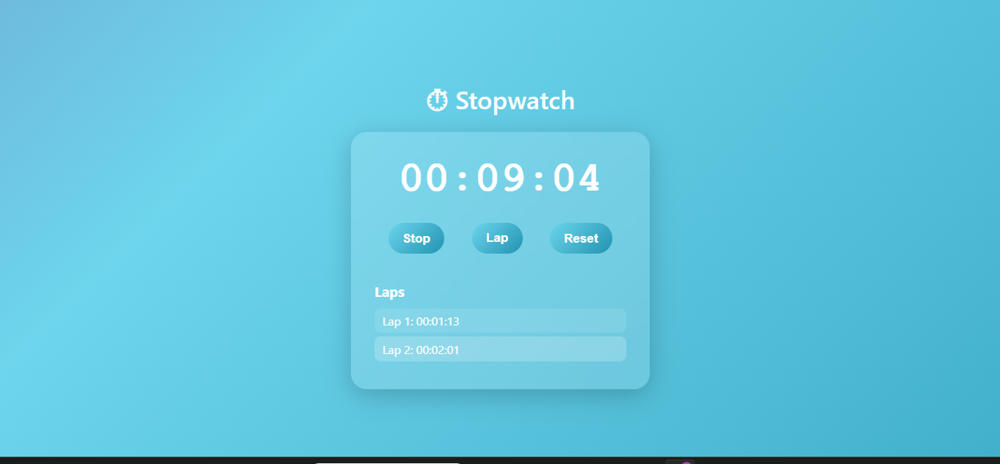

# ⏱ Stopwatch Web Application

A sleek, modern, and interactive stopwatch built with **HTML, CSS, and JavaScript**.  
It features start/stop, reset, and lap time recording, wrapped in a clean **glassmorphism UI** with animated gradients.  

 <!-- (Optional: add a screenshot of your app here) -->

---

## 🚀 Features
- **Start / Stop** the stopwatch with one click.
- **Lap Recording** with an auto-numbered lap list.
- **Reset Functionality** to clear time and laps.
- **Responsive Design** – works on desktops, tablets, and mobiles.
- **Modern UI** with:
  - Glassmorphism card
  - Animated gradient background
  - Rounded, glowing buttons with hover effects
  - Scrollable lap list with alternating colors

---

## 📂 Project Structure
Stopwatch-App/
│── index.html # Main HTML structure
│── styles.css # Styling (UI, animations, layout)
│── script.js # Stopwatch functionality
│── README.md # Documentation
│── preview.png # (Optional) App screenshot


---

## 🛠️ Technologies Used
- **HTML5** – For page structure  
- **CSS3** – For layout, animations, and glassmorphism design  
- **JavaScript (Vanilla)** – For stopwatch logic and DOM manipulation  

---

## 🎮 How to Use
1. Clone or download the repository:
   ```bash
   git clone https://github.com/your-username/stopwatch-app.git
   cd stopwatch-app


Open index.html in your browser.

Use the buttons:

Start / Stop → Start or pause the stopwatch

Lap → Save the current time as a lap

Reset → Reset the stopwatch and clear laps

📸 Example Laps
Lap 1: 00:15:32
Lap 2: 00:28:49
Lap 3: 01:02:14


